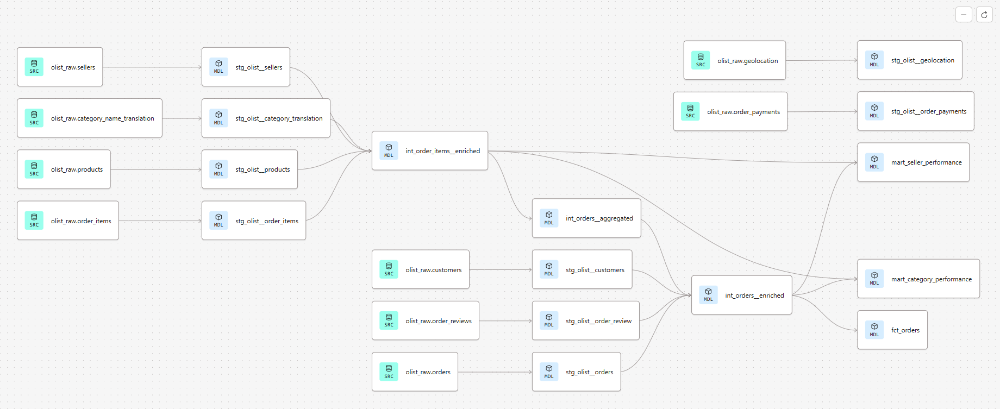

# olist-funnel-analysis

Pipeline analítica de ponta a ponta sobre o [Brazilian E-Commerce Public Dataset da Olist](https://www.kaggle.com/datasets/olistbr/brazilian-ecommerce), construída com Python, dbt e BigQuery. O projeto aplica práticas de Analytics Engineering para responder perguntas reais de negócio sobre performance operacional, comercial e de vendedores em um marketplace brasileiro.

Teste na sua máquina: [setup](SETUP.md)

---

## Perguntas de negócio

| # | Pergunta | Mart |
|---|----------|------|
| 1 | A Olist entrega no prazo? Onde estão os atrasos? | `fct_orders` |
| 2 | Quais categorias têm maior receita e melhor satisfação? | `mart_category_performance` |
| 3 | Quais vendedores entregam melhor experiência ao cliente? | `mart_seller_performance` |

---

## Dashboard

[Acessar no Looker Studio](https://datastudio.google.com/reporting/dfd5c732-95a3-4204-adfd-dbb5db8cac5d)

### Visualizações

**Overview Operacional**


**Performance por Categoria**


**Análise de Vendedores**


### Principais Insights

1. **Atrasos concentrados em categorias pesadas**: 28% dos pedidos de móveis atrasam vs 12% média geral
2. **Sellers SP têm review score 0.4 pontos maior** que média nacional (controle de qualidade?)
3. **Freight ratio acima de 20% correlaciona com review score <3** (cliente penaliza frete caro)

---

## Roadmap

Evoluções técnicas planejadas:

- [ ] Modelo preditivo de atraso usando XGBoost (features: categoria, peso, distância, seller_state)
- [ ] Análise de cohort de retenção (% clientes que recompram por mês de primeira compra)
- [ ] Dashboard de anomalia: alertar quando métricas-chave saem do padrão histórico
- [ ] Integração com API Correios para benchmark custo real vs cobrado
- [ ] Pipeline incremental no dbt (atualizar apenas dados novos, não full refresh)

---

## Arquitetura

```
Kaggle API
    │
    ▼
Python (pandas + kagglehub)
    │  ingestão via API, tratamento de encoding, upload pro BQ
    ▼
BigQuery — dataset raw
    │
    ▼
dbt Cloud (dbt Fusion 2.0)
    ├── staging       → 9 views   (rename, cast, limpeza)
    ├── intermediate  → 3 views   (joins, cálculos de domínio)
    └── marts         → 3 tables  (agregações finais)
    │
    ▼
Looker Studio
```

---

## Lineage

> 

---

## Estrutura do repositório

```
├── models/
│   ├── staging/
│   │   └── olist/
│   │       ├── _olist__sources.yml       # declaração das 9 tabelas raw
│   │       ├── _olist__models.yml        # testes e docs da staging
│   │       ├── stg_olist__orders.sql
│   │       ├── stg_olist__customers.sql
│   │       ├── stg_olist__order_items.sql
│   │       ├── stg_olist__order_payments.sql
│   │       ├── stg_olist__order_review.sql
│   │       ├── stg_olist__products.sql
│   │       ├── stg_olist__sellers.sql
│   │       ├── stg_olist__geolocation.sql
│   │       └── stg_olist__category_translation.sql
│   ├── intermediate/
│   │   ├── int_order_items__enriched.sql
│   │   ├── int_orders__aggregated.sql
│   │   └── int_orders__enriched.sql
│   └── marts/
│       ├── operational/
│       │   ├── _operational__models.yml
│       │   └── fct_orders.sql
│       └── commercial/
│           ├── _commercial__models.yml
│           ├── mart_category_performance.sql
│           └── mart_seller_performance.sql
├── packages.yml
├── dbt_project.yml
└── requirements.txt
```

---

## Camadas dbt

### Staging
Uma view por tabela raw. Responsabilidade restrita: rename de colunas para convenção padrão, cast de tipos, limpeza mínima. Sem joins.

Convenções aplicadas:
- Timestamps de evento com sufixo `_at` (`purchased_at`, `approved_at`)
- Monetário como `NUMERIC` (evita imprecisão de float em agregações)
- CEPs como `STRING` (preserva zeros à esquerda)
- Texto livre com `LOWER` + `TRIM` antes de agregações

### Intermediate
Joins e cálculos de domínio reutilizáveis. Nenhum mart acessa staging diretamente.

| Modelo | Responsabilidade |
|--------|-----------------|
| `int_order_items__enriched` | order_items + products + sellers + category_translation |
| `int_orders__aggregated` | agrega itens por pedido (receita, frete, contagens) |
| `int_orders__enriched` | orders + customers + reviews + agregado de itens + flags e deltas temporais |

### Marts
Tabelas materializadas, prontas pro Looker. Granularidade e métricas documentadas no yml de cada camada.

| Mart | Granularidade | Principais métricas |
|------|--------------|---------------------|
| `fct_orders` | 1 linha por pedido | prazo real, atraso, review score, receita, flags |
| `mart_category_performance` | 1 linha por (categoria, mês) | receita, ticket médio, freight ratio, review score |
| `mart_seller_performance` | 1 linha por seller | receita, prazo médio, % atraso, review score |

---

## Testes

84 testes automatizados cobrindo staging e marts.

| Tipo | Cobertura |
|------|-----------|
| `not_null` | PKs e FKs críticas em todas as camadas |
| `unique` | PKs de todas as tabelas |
| `accepted_values` | `order_status`, `payment_type`, `review_score` |
| `relationships` | integridade referencial entre staging models |
| `dbt_utils.unique_combination_of_columns` | PKs compostas (`order_id + order_item_id`, `order_id + payment_sequential`) |

```bash
dbt test                     # todos os testes
dbt test --select staging.*  # só staging
dbt test --select marts.*    # só marts
```

---

## Decisões técnicas

**Service accounts separadas para ingestão e transformação**
O pipeline Python usa uma SA com permissão de escrita restrita ao dataset `raw`. O dbt usa uma SA separada com leitura em `raw` e escrita nos datasets de transformação. Princípio de least privilege aplicado desde o início.

**Staging conservadora em testes de unicidade**
Testes `unique` e `relationships` foram adicionados após exploração, não antes. Dois casos de inconsistência descobertos e documentados:
- `order_reviews`: `review_id` não é PK confiável — o mesmo ID aparece em pedidos distintos (bug de sistema na origem). PK garantida é `order_id` via deduplicação.
- `geolocation`: sem PK única por design — múltiplas coordenadas por prefixo de CEP.

**Deduplicação de reviews na staging**
0.56% dos pedidos tinham múltiplas avaliações (551 casos). Tratado via `ROW_NUMBER() OVER (PARTITION BY order_id ORDER BY review_answered_at DESC)`, preservando a avaliação mais recente por pedido.

**Geolocation agregada na staging**
A raw tem 1 milhão+ de linhas para ~19k CEPs únicos (média de 52 coordenadas por prefixo). A staging agrega via `AVG(lat/lng)` para produzir 1 linha por CEP, reduzindo o volume em 98% antes de qualquer join downstream.

**Typos preservados na source, corrigidos na staging**
O dataset Olist original tem `product_name_lenght` e `product_description_lenght` (typo em "length"). A source documenta o nome real da coluna. A staging corrige para `product_name_length` e `product_description_length`. Rastreabilidade total da decisão.

**dbt Fusion (preview)**
O projeto roda em dbt Fusion 2.0 (motor reescrito em Rust pelo dbt Labs). Diferença de sintaxe em relação ao dbt Core: parâmetros de testes genéricos como `relationships` e `accepted_values` ficam dentro de `arguments:`.

---

## Como rodar

**Pré-requisitos**: Python 3.12+, conta no dbt Cloud, projeto no Google BigQuery, credenciais Kaggle configuradas.

**1. Ingestão dos dados raw**

```bash
pip install -r requirements.txt
python -m kaggle.runner_get_upload
```

Baixa o dataset do Kaggle e carrega as 9 tabelas no dataset `raw` do BigQuery.

**2. Transformação com dbt**

```bash
dbt deps            # instala dbt_utils 1.3.3
dbt build           # run + test em todas as camadas
dbt docs generate   # gera documentação e lineage
```

---

## Stack

| Camada | Tecnologia |
|--------|-----------|
| Ingestão | Python 3.12, pandas, kagglehub, google-cloud-bigquery |
| Warehouse | Google BigQuery |
| Transformação | dbt Cloud, dbt Fusion 2.0 preview, dbt_utils 1.3.3 |
| Visualização | Looker Studio |
| Versionamento | Git + GitHub |
