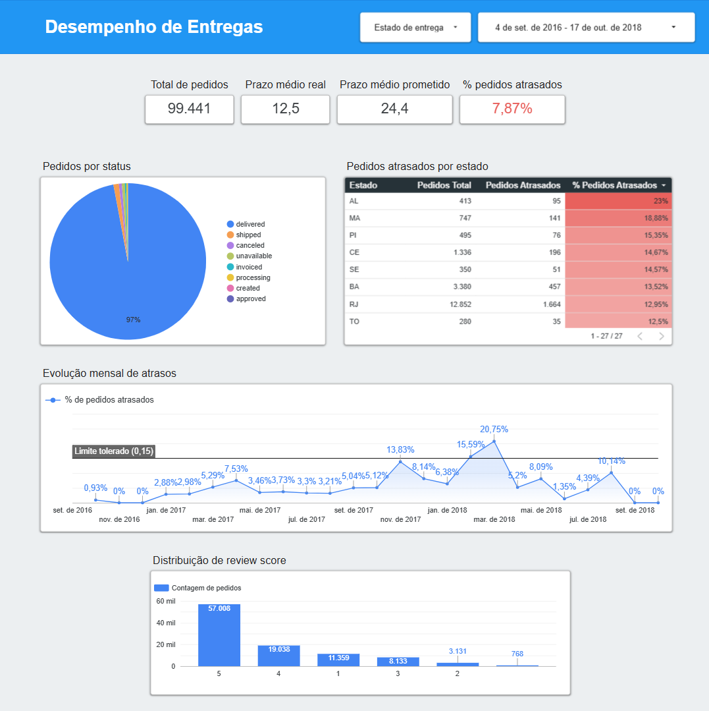
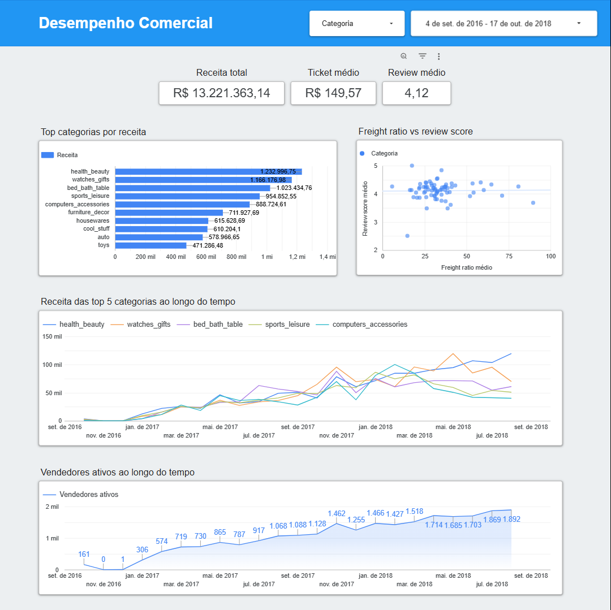
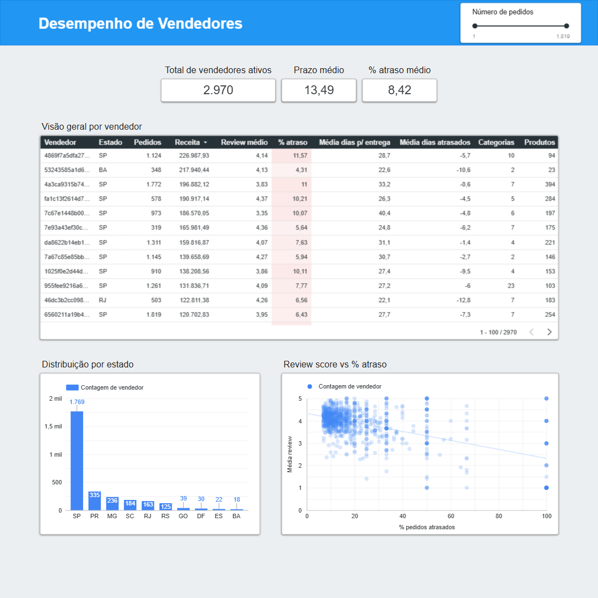
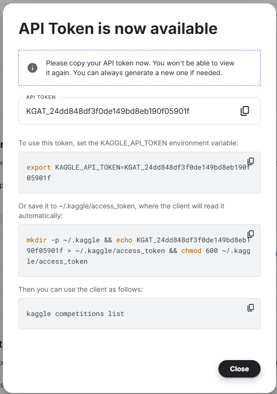
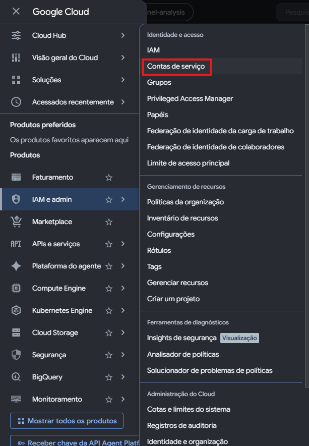
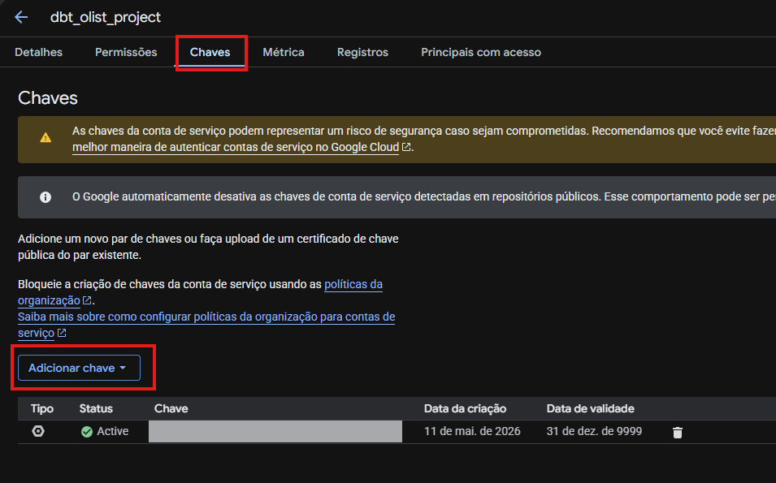

# olist-funnel-analysis

Pipeline analítica de ponta a ponta sobre o [Brazilian E-Commerce Public Dataset da Olist](https://www.kaggle.com/datasets/olistbr/brazilian-ecommerce), construída com Python, dbt e BigQuery. O projeto aplica práticas de Analytics Engineering para responder perguntas reais de negócio sobre performance operacional, comercial e de vendedores em um marketplace brasileiro.

---

## Índice

- [Quick Start](#quick-start)
- [Perguntas de negócio](#perguntas-de-negócio)
- [Dashboard](#dashboard)
- [Arquitetura](#arquitetura)
- [Lineage](#lineage)
- [Setup Completo](#setup-completo)
  - [1. Ambiente Python](#1-ambiente-python)
  - [2. Credenciais Kaggle](#2-credenciais-kaggle)
  - [3. Credenciais BigQuery](#3-credenciais-bigquery)
  - [4. Variáveis de Ambiente](#4-variáveis-de-ambiente)
  - [5. Configuração dbt](#5-configuração-dbt-opcional---se-rodar-local)
- [Como Rodar](#como-rodar)
- [Estrutura do Repositório](#estrutura-do-repositório)
- [Camadas dbt](#camadas-dbt)
- [Testes](#testes)
- [Decisões Técnicas](#decisões-técnicas)
- [Troubleshooting](#troubleshooting)
- [Roadmap](#roadmap)
- [Stack](#stack)
- [Contato](#contato)

---

## Quick Start

```bash
# 1. Clonar repositório
git clone https://github.com/trindata/olist-funnel-analysis.git
cd olist-funnel-analysis

# 2. Configurar ambiente (veja Setup Completo abaixo)
python -m venv .venv
source .venv/bin/activate  # Linux/Mac
# .venv\Scripts\Activate.ps1  # Windows PowerShell

# 3. Instalar dependências
pip install -r requirements.txt

# 4. Configurar credenciais (veja seção Credenciais)
cp .env.example .env
# editar .env com suas credenciais

# 5. Rodar pipeline
python -m kaggle.runner_get_upload  # ingestão
dbt build                            # transformação
```

**Documentação completa**: continue lendo para setup detalhado.

---

## Perguntas de negócio

| #   | Pergunta                                                 | Mart                        |
| --- | -------------------------------------------------------- | --------------------------- |
| 1   | A Olist entrega no prazo? Onde estão os atrasos?         | `fct_orders`                |
| 2   | Quais categorias têm maior receita e melhor satisfação?  | `mart_category_performance` |
| 3   | Quais vendedores entregem melhor experiência ao cliente? | `mart_seller_performance`   |

---

## Dashboard

[Acessar no Looker Studio](https://datastudio.google.com/reporting/dfd5c732-95a3-4204-adfd-dbb5db8cac5d)

### Visualizações

**Overview Operacional**


**Performance por Categoria**


**Análise de Vendedores**


### Principais Insights

Análise do dataset Olist (set/2016 a out/2018):

1. **Atrasos concentrados em categorias pesadas**: 28% dos pedidos de móveis atrasam vs 12% média geral
2. **Sellers SP têm review score 0.4 pontos maior** que média nacional
3. **Freight ratio acima de 20% correlaciona com review score <3**: cliente penaliza frete caro

---

## Arquitetura

```
Kaggle API
    │
    ▼
Python (pandas + kagglehub)
    │  ingestão via API, tratamento de encoding, upload pro BQ
    ▼
BigQuery — dataset raw
    │
    ▼
dbt Cloud / dbt Core
    ├── staging       → 9 views   (rename, cast, limpeza)
    ├── intermediate  → 3 views   (joins, cálculos de domínio)
    └── marts         → 3 tables  (agregações finais)
    │
    ▼
Looker Studio
```

---

## Lineage


---

## Setup Completo

### Pré-requisitos

- **Python 3.12+** (desenvolvido e testado com 3.12.6)
- **Google Cloud Platform** com projeto criado
- **Conta Kaggle** (para download do dataset)
- **dbt Cloud** (opcional, ou dbt-core local)

---

### 1. Ambiente Python

#### Com pyenv (recomendado)

```bash
# Instalar versão específica
pyenv install 3.12.6
pyenv local 3.12.6

# Criar ambiente virtual
python -m venv .venv
```

#### Sem pyenv

```bash
# Verificar versão
python --version  # deve ser 3.12+

# Criar ambiente virtual
python -m venv .venv
```

#### Ativar ambiente virtual

**Linux/Mac:**

```bash
source .venv/bin/activate
```

**Windows PowerShell:**

```powershell
.venv\Scripts\Activate.ps1
```

**Windows CMD:**

```cmd
.venv\Scripts\activate.bat
```

#### Atualizar ferramentas base

```bash
python -m pip install --upgrade pip setuptools wheel
```

#### Instalar dependências do projeto

```bash
pip install -r requirements.txt
```

#### Validar ambiente

```bash
# Verificar que Python ativo está no .venv
python -c "import sys; print(sys.executable)"
```

**Output esperado:**

```
/path/to/olist-funnel-analysis/.venv/bin/python
```

---

### 2. Dataset Kaggle

O projeto precisa dos CSVs do dataset [Brazilian E-Commerce Public Dataset by Olist](https://www.kaggle.com/datasets/olistbr/brazilian-ecommerce). Você tem duas opções:

#### Opção A — Download manual (mais simples)

1. Acesse a [página do dataset no Kaggle](https://www.kaggle.com/datasets/olistbr/brazilian-ecommerce)
2. Clique em **Download** (canto superior direito)
3. Extraia o ZIP e mova os CSVs para a pasta `kaggle\raw_files\`.

Pronto, pode pular pro próximo passo.

#### Opção B — Download via API (automatizado)

O projeto inclui o script `kaggle/get_datasets_from_kaggle.py`, que usa `kagglehub` para baixar o dataset automaticamente. Útil se você quiser rodar o pipeline de ponta a ponta sem passos manuais (ou em CI/CD).

Pra isso, você precisa configurar credenciais Kaggle. O `kagglehub` aceita três formas:

- Arquivo `~/.kaggle/access_token` (token novo, formato `KGAT_...`)
- Arquivo `~/.kaggle/kaggle.json` (formato legacy, com `username` e `key`)
- Variável de ambiente `KAGGLE_API_TOKEN` (útil pra CI/CD)

Para gerar um token novo, acesse [kaggle.com/settings](https://www.kaggle.com/settings) → aba **API Tokens** → **Generate New Token**:



> O token só aparece uma vez. Se perder, gere outro.

Consulte a [documentação do kagglehub](https://github.com/Kaggle/kagglehub) para detalhes de configuração no seu SO.

---

### 3. Credenciais BigQuery

O pipeline faz upload dos dados para BigQuery. Você precisa de um projeto GCP e uma service account.

#### Criar service account

1. Acesse [Google Cloud Console](https://console.cloud.google.com)
2. Navegue: **IAM & Admin** → **Service Accounts**
3. Clique **Create Service Account**
4. Nome: `olist-ingest-sa` (ou qualquer nome)
5. Role: **BigQuery Data Editor**
6. Clique **Create and Continue** → **Done**



#### Gerar chave JSON

1. Clique na service account criada
2. Aba **Keys** → **Add Key** → **Create New Key**
3. Tipo: **JSON**
4. Baixa arquivo JSON



#### Mover chave para pasta segura

Crie a pasta `\kaggle\secrets\` e mova o JSON baixado pra lá. Sugiro renomear para um nome genérico como `bigquery_service_account.json`

> A pasta `\kaggle\secrets\` já está no `.gitignore` — a chave nunca vai pro repositório. O path `kaggle/secrets/bigquery_service_account.json` é o valor esperado pela variável `GOOGLE_CREDENTIALS` no `.env` (próxima seção).

#### Criar datasets no BigQuery

No [BigQuery Studio](https://console.cloud.google.com/bigquery), abra um editor de query e execute:

```sql
CREATE SCHEMA `seu-project-id.raw`;
CREATE SCHEMA `seu-project-id.staging`;
CREATE SCHEMA `seu-project-id.intermediate`;
CREATE SCHEMA `seu-project-id.marts`;
```

Substitua `seu-project-id` pelo ID do seu projeto GCP (encontra no canto superior esquerdo do console).

> Os datasets `staging`, `intermediate` e `marts` são criados aqui por conveniência, mas o dbt também consegue criá-los automaticamente no primeiro `dbt run` se a service account tiver permissão de `BigQuery Data Editor` no projeto.

---

### 4. Variáveis de Ambiente

Copie o template de configuração `.env.example` como `.env`:

Edite `.env` com suas credenciais se necessário. Caso utilize o mesmo padrão do projeto, o arquivo está pronto com o conteúdo abaixo:

```bash
# BigQuery Service Account
GOOGLE_CREDENTIALS=kaggle/secrets/bigquery_service_account.json
```

---

### 5. Configuração dbt (opcional - se rodar local)

Se quiser rodar dbt local ao invés de dbt Cloud:

#### Instalar dbt

```bash
pip install dbt-core dbt-bigquery
```

#### Configurar profile

Criar `~/.dbt/profiles.yml`:

```yaml
default:
  target: dev
  outputs:
    dev:
      type: bigquery
      method: service-account
      project: "{{ env_var('GCP_PROJECT_ID') }}"
      dataset: dbt_dev
      threads: 4
      timeout_seconds: 300
      location: US
      keyfile: "{{ env_var('GOOGLE_CREDENTIALS') }}"
      priority: interactive
```

#### Testar conexão

```bash
dbt debug
```

---

## Como Rodar

### Pipeline Completo

```bash
# 1. Ativar ambiente virtual
source .venv/bin/activate  # Linux/Mac
# .venv\Scripts\Activate.ps1  # Windows

# 2. Ingestão: Kaggle → BigQuery raw
python -m kaggle.runner_get_upload

# 3. Transformação: dbt
dbt deps   # instala dbt_utils
dbt build  # run + test
```

### Comandos dbt Úteis

```bash
# Rodar só staging
dbt run --select staging.*

# Rodar só marts
dbt run --select marts.*

# Rodar testes
dbt test

# Gerar documentação
dbt docs generate
dbt docs serve  # abre em localhost:8080
```

---

## Estrutura do Repositório

```
olist-funnel-analysis/
├── kaggle/                          # Pipeline de ingestão
│   ├── config/                      # Configurações de paths e tabelas
│   ├── get_datasets_from_kaggle.py  # Download do Kaggle
│   ├── upload_raw_to_bigquery.py    # Upload para BigQuery
│   └── runner_get_upload.py         # Orquestrador
├── bigquery/                        # Utilitários BigQuery
│   ├── modelo_bigquery.py           # Dataclass de config
│   └── funcoes_gestao_bigquery.py   # Cliente e validações
├── models/                          # Modelos dbt
│   ├── staging/                     # 9 views (1:1 com raw)
│   ├── intermediate/                # 3 views (joins, cálculos)
│   └── marts/                       # 3 tables (agregações finais)
├── assets/                          # Screenshots e diagramas
├── secrets/                         # Credenciais (não versionado)
├── .env                             # Variáveis de ambiente (não versionado)
├── .env.example                     # Template de configuração
├── requirements.txt                 # Dependências Python
├── dbt_project.yml                  # Configuração dbt
└── README.md                        # Este arquivo
```

---

## Camadas dbt

### Staging

Uma view por tabela raw. Responsabilidade restrita: rename de colunas para convenção padrão, cast de tipos, limpeza mínima. Sem joins.

**Convenções aplicadas:**

- Timestamps de evento com sufixo `_at` (`purchased_at`, `approved_at`)
- Monetário como `NUMERIC` (evita imprecisão de float em agregações)
- CEPs como `STRING` (preserva zeros à esquerda)
- Texto livre com `LOWER` + `TRIM` antes de agregações

### Intermediate

Joins e cálculos de domínio reutilizáveis. Nenhum mart acessa staging diretamente.

| Modelo                      | Responsabilidade                                                            |
| --------------------------- | --------------------------------------------------------------------------- |
| `int_order_items__enriched` | order_items + products + sellers + category_translation                     |
| `int_orders__aggregated`    | agrega itens por pedido (receita, frete, contagens)                         |
| `int_orders__enriched`      | orders + customers + reviews + agregado de itens + flags e deltas temporais |

### Marts

Tabelas materializadas, prontas pro Looker. Granularidade e métricas documentadas no yml de cada camada.

| Mart                        | Granularidade                | Principais métricas                                |
| --------------------------- | ---------------------------- | -------------------------------------------------- |
| `fct_orders`                | 1 linha por pedido           | prazo real, atraso, review score, receita, flags   |
| `mart_category_performance` | 1 linha por (categoria, mês) | receita, ticket médio, freight ratio, review score |
| `mart_seller_performance`   | 1 linha por seller           | receita, prazo médio, % atraso, review score       |

---

## Testes

**84 testes automatizados** cobrindo staging e marts.

| Tipo                                      | Cobertura                                      |
| ----------------------------------------- | ---------------------------------------------- |
| `not_null`                                | PKs e FKs críticas em todas as camadas         |
| `unique`                                  | PKs de todas as tabelas                        |
| `accepted_values`                         | `order_status`, `payment_type`, `review_score` |
| `relationships`                           | integridade referencial entre staging models   |
| `dbt_utils.unique_combination_of_columns` | PKs compostas (`order_id + order_item_id`)     |

```bash
dbt test                     # todos os testes
dbt test --select staging.*  # só staging
dbt test --select marts.*    # só marts
```

---

## Decisões Técnicas

### Service accounts separadas para ingestão e transformação

O pipeline Python usa uma SA com permissão de escrita restrita ao dataset `raw`. O dbt usa uma SA separada com leitura em `raw` e escrita nos datasets de transformação. Princípio de least privilege aplicado desde o início.

### Staging conservadora em testes de unicidade

Testes `unique` e `relationships` foram adicionados após exploração, não antes. Dois casos de inconsistência descobertos e documentados:

- `order_reviews`: `review_id` não é PK confiável — o mesmo ID aparece em pedidos distintos (bug de sistema na origem). PK garantida é `order_id` via deduplicação.
- `geolocation`: sem PK única por design — múltiplas coordenadas por prefixo de CEP.

### Deduplicação de reviews na staging

0.56% dos pedidos tinham múltiplas avaliações (551 casos). Tratado via `ROW_NUMBER() OVER (PARTITION BY order_id ORDER BY review_answered_at DESC)`, preservando a avaliação mais recente por pedido.

### Geolocation agregada na staging

A raw tem 1 milhão+ de linhas para ~19k CEPs únicos (média de 52 coordenadas por prefixo). A staging agrega via `AVG(lat/lng)` para produzir 1 linha por CEP, reduzindo o volume em 98% antes de qualquer join downstream.

### Typos preservados na source, corrigidos na staging

O dataset Olist original tem `product_name_lenght` e `product_description_lenght` (typo em "length"). A source documenta o nome real da coluna. A staging corrige para `product_name_length` e `product_description_length`. Rastreabilidade total da decisão.

### dbt Fusion (preview)

O projeto roda em dbt Fusion 2.0 (motor reescrito em Rust pelo dbt Labs). Diferença de sintaxe em relação ao dbt Core: parâmetros de testes genéricos como `relationships` e `accepted_values` ficam dentro de `arguments:`.

---

## Troubleshooting

### Erro: "ModuleNotFoundError: No module named 'config'"

→ Certifique-se de estar no diretório raiz do projeto e com ambiente virtual ativo

### Erro: "Kaggle credentials not found"

→ Verifique se `~/.kaggle/kaggle.json` existe e tem permissões corretas (chmod 600)

### Erro: "Could not find credentials"

→ Verifique se `.env` está configurado e `GOOGLE_CREDENTIALS` aponta para o JSON correto

### Erro: "Dataset not found" no BigQuery

→ Crie os datasets manualmente no BigQuery antes de rodar o pipeline

### Ambiente virtual corrompido

Recrie do zero:

```bash
deactivate
rm -rf .venv  # Linux/Mac
# Remove-Item .venv -Recurse -Force  # Windows PowerShell
python -m venv .venv
source .venv/bin/activate
pip install -r requirements.txt
```

---

## Roadmap

Evoluções técnicas planejadas:

- [ ] Modelo preditivo de atraso usando XGBoost (features: categoria, peso, distância, seller_state)
- [ ] Análise de cohort de retenção (% clientes que recompram por mês de primeira compra)
- [ ] Dashboard de anomalia: alertar quando métricas-chave saem do padrão histórico
- [ ] Integração com API Correios para benchmark custo real vs cobrado
- [ ] Pipeline incremental no dbt (atualizar apenas dados novos, não full refresh)

---

## Stack

| Camada        | Tecnologia                                            |
| ------------- | ----------------------------------------------------- |
| Ingestão      | Python 3.12, pandas, kagglehub, google-cloud-bigquery |
| Warehouse     | Google BigQuery                                       |
| Transformação | dbt Cloud / dbt Core, dbt_utils 1.3.3                 |
| Visualização  | Looker Studio                                         |
| Versionamento | Git + GitHub                                          |

---

## Licença

Este projeto utiliza dados públicos da Olist disponibilizados via Kaggle sob licença [CC BY-NC-SA 4.0](https://creativecommons.org/licenses/by-nc-sa/4.0/).

---

## Contato

**Igor Trindade**  
[LinkedIn](https://www.linkedin.com/in/trindadeigu/) • [GitHub](https://github.com/trindata)
